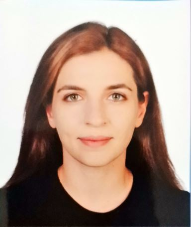

---
install.packages(c("knitr", "rmarkdown"))
title: "Hakkımda"
sidebar: false 
 pdf: default
---

{width="250"}

# Eğitim

-   B.S., Makine Mühendisliği, Orta Doğu Teknik Üniversitesi, Turkiye, 2016 - 2023.
-   M.S., Industrial Engineering, Hacettepe University, Turkey, 2025 - devam ediyor

# İş Tecrübesi

-   Proted Protez-Ortez, AR-GE Mühendisi, 2025-Halen

-   Ottonom Mühendislik, Mekanik Tasarım Mühendisi, 2024

# Staj Tecrübesi

-   Simofis Mühendislik, Yapısal Analiz Stajyeri, 2021

# Projects

-   TUBİTAK 2209-Production and Performance Evaluation of Natural Zeolite Plate Composite Trombe Wall System for Near Zero Energy Buildings
-   Borusan- Lisans Bitirme Projesi- HDPE Kaplı Boru Yüzeyi Pürüzlendirme Makinesi Tasarım ve Üretimi

# Competencies

-   Solidworks
-   Simcenter 3D
-   MATLAB

# Hobbies

-   Hentbol
-   Koşu
